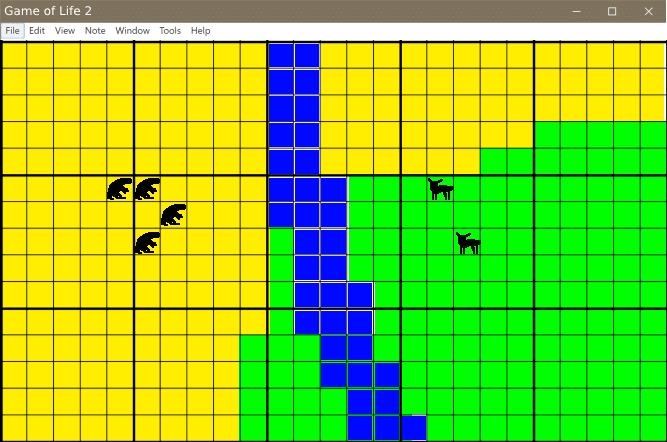

### Game of Life 2 (working title)

### Made by:
---
#### Nicholas Scripps
#### Jeffrey Sheets
---
## 1 Abstract

Conway's game of life is a 1970 game consisting of cells that are either on or off. The rules are simple, a cell that is off will turn on if it has exactly 3 neighbors, and a cell that is on will remain on if it has 2 or 3 neighbors, otherwise, the cell will turn or remain off. This was originally made as a thought experiment and also a way to demonstrate a concept, how complex Behavior can evolve from a set of Simple Rules. This application is designed to build off of that concept, Specifically to create more complex unpredictable Behavior, While still being easy to understand even for a casual Observer.

## 2 Introduction

The Game of Life 2 (working title) is an application that allows a user to create an environment, add organisms to it, and let it simulate throughout the day on the server. In the original game of life it can model complex behaviors but anything made by a casual user will collapse or stabilize within a few short cycles. Instead of having a cell be on or off, The Game of Life 2 (working title) allows a user to create an environment with different terrain features and populate it with a selection of organisms. For example A squirrel can be added which moves from tree to tree and tries to avoid any predator organisms. This behavior is still easy to understand but when put into a large grid with several other organisms that have their own behavior it may be difficult to predict what the long-term State might evolve into. The application connects to a server which simulates the game on a database which runs in the background even when the user is not using it. This way, it is possible to check up on the environment after a period of time in order to see whether or not it has reached a stable state. 

  
   
   
  UI

## 3 Architectural Design

### 3.1 Use Case Diagram

For the case diagram there are four ways that the player can interact with the game. They can add an animals or resources, they can start the game, and pause the game. When each animal is placed in the game it has set traits. These traits include: field of view - which is how many squares around them they can see resources, hunger resistence - which is how long an animal can go before it starves, and thirst resistenc - which is how long an animal can go before it's thirsty.

  
   
   
  Use Case Diagram

### 3.2 Class Diagram

The main UI for the game is the grid. Each cell on the grid can either contain an animal or a resource that animal can use.

  
   
   
  Class Diagram

### 3.3 Sequence Diagram

When a player places an entity, either an animal or a resource, the information on what animal was chosen and its location are sent to the control class. From there a new creature object is created which would have set traits. Then this animal object is attached to the animal on the UI.

  
   
   
  Sequence Diagram

## Risk Analysis

## Retrospective
